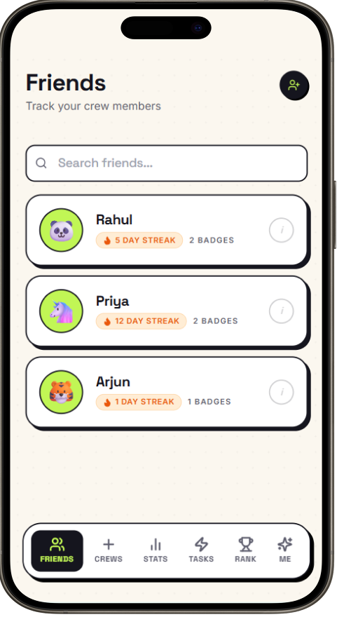
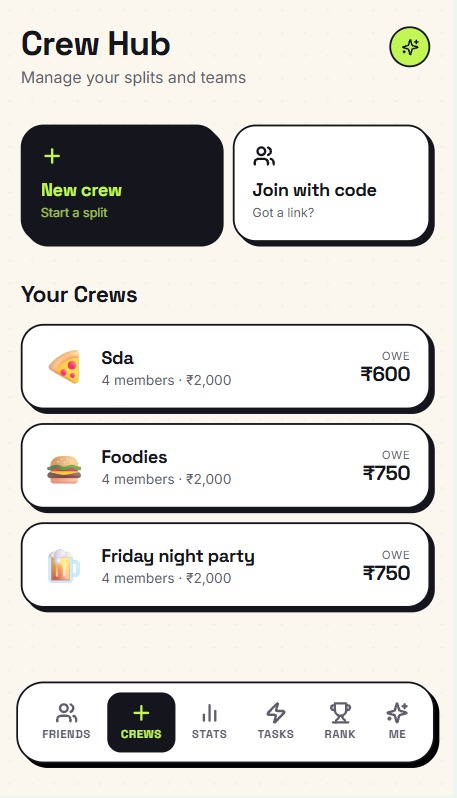
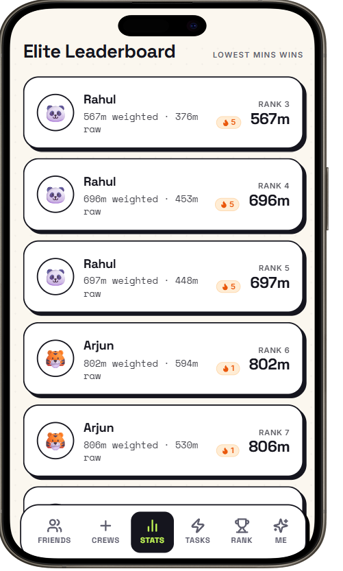
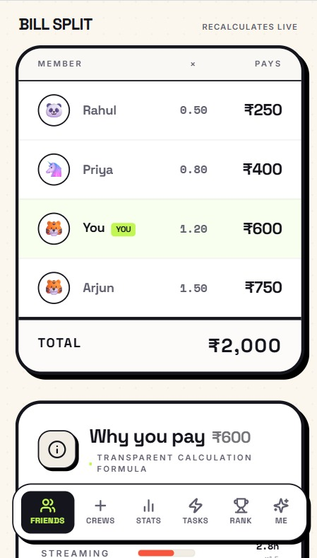
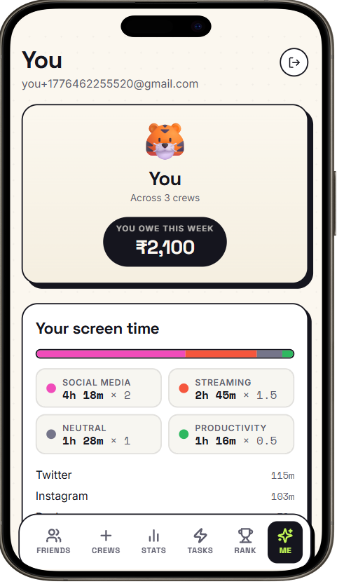
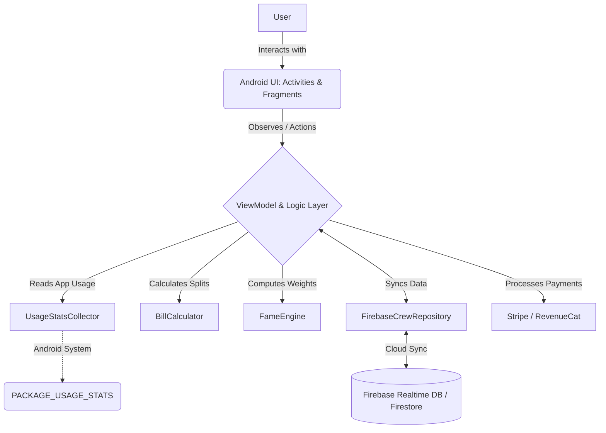

<div align="center">
  <h1>ByteShare</h1>
  <p>Make your screen-time social, competitive, and rewarding.</p>
</div>

## Overview
ByteShare is an Android application designed to help people reduce unnecessary phone usage when spending time with friends, family, or colleagues. Instead of just displaying a static graph of "time spent," ByteShare turns screen-time tracking into a social, gamified experience where being present pays off—literally.

## Why ByteShare?
Phones are a major distraction during social gatherings. Friends go out for dinner, but spend the evening scrolling. People study together but get distracted by social media. Simply knowing your screen-time isn't enough to motivate change.

ByteShare makes screen-time:
- **Social**
- **Competitive**
- **Group-based**
- **Gamified**
- **Connected to real-world consequences**

## How ByteShare Works
1. **Join a Crew**: Create or join a "Crew" with your friends using a joining code.
2. **Track Usage**: ByteShare reads your available Android usage statistics.
3. **Categorize & Weight**: App usage is grouped into categories and weighted.
4. **Rank Up**: Crew members are ranked against each other. Lower weighted screen-time equals a better rank!
5. **Split the Bill**: Your rank influences how much you contribute toward a shared bill. Less scrolling = pay less.
6. **Compete & Improve**: Use social competition, challenges, and streaks to stay present.

## Core Features

### Crews
Users can easily create or join a Crew. Keep track of members, view real-time rankings, and participate in Crew-specific challenges to improve everyone's focus.

### Screen-Time Tracking
ByteShare securely accesses your device's usage statistics to calculate how much time you spend on various apps.

### Weighted Screen-Time
Not all screen-time is created equal. ByteShare uses a gamified scoring system to categorize and weight different types of app usage:

- **Social Media** (Instagram, Snapchat, Twitter): `2.0×` Weight
- **Streaming** (YouTube, Netflix): `1.5×` Weight
- **Neutral** (Maps, Calculator): `1.0×` Weight
- **Productivity** (Notion, Calendar, Duolingo): `0.5×` Weight

*For example, 1 hour of Instagram counts as 2 weighted hours, while 1 hour of Notion counts as 0.5 weighted hours.*

### Fame Engine & Leaderboard
Our proprietary **Fame Engine** calculates a weighted screen-time score for each user. In the leaderboard, **lower weighted screen-time gets the better rank**. 

### Bill Splitting
ByteShare introduces a transparent, dynamic bill breakdown. The bill is redistributed among Crew members based on their screen-time rank, so the most present people are rewarded with a lower share of the bill.

### Friends, Challenges & Streaks
The app features friend lists, streaks, and challenges (like Detox challenges or Screen Sabbaths) to keep the community motivated. *(Note: Some challenge mechanics are still in active development/future roadmap).*

## Example: A ₹2,000 Dinner
Four friends go out for dinner. The total bill is **₹2,000**.
Their weighted screen-time rankings are:
- **Rahul** → Rank 1 (Lowest usage)
- **Priya** → Rank 2
- **You** → Rank 3
- **Arjun** → Rank 4 (Highest usage)

An equal split would be **₹500** each. But with the Fame Engine multipliers:

- **Rank 1**: ₹500 × 0.5 = **₹250**
- **Rank 2**: ₹500 × 0.8 = **₹400**
- **Rank 3**: ₹500 × 1.2 = **₹600**
- **Rank 4**: ₹500 × 1.5 = **₹750**

**Total: ₹2,000**
The user who stayed off their phone pays less, while the most distracted user pays more!

## Screenshots

<div align="center">
  <h3>Dashboard</h3>
  
  <br>
  <i>Dashboard showing the user's current screen-time status and Crew-related information.</i>
</div>

<br>

<div align="center">
  <h3>Crew Details</h3>
  
  <br>
  <i>Detailed view of a Crew, its members, and active stats.</i>
</div>

<br>

<div align="center">
  <h3>Leaderboard</h3>
  
  <br>
  <i>Leaderboard showing Crew members ranked by weighted screen-time.</i>
</div>

<br>

<div align="center">
  <h3>Bill Breakdown</h3>
  
  <br>
  <i>Transparent bill breakdown showing how each member's screen-time rank affects their contribution.</i>
</div>

<br>

<div align="center">
  <h3>Profile</h3>
  
  <br>
  <i>User profile highlighting personal statistics and friends.</i>
</div>

## UI/UX
ByteShare's design emphasizes a bold, friendly, and gamified experience. It utilizes high contrast, rounded cards, a lime/green accent color, and friendly avatars to feel social and playful, rather than like a traditional health tracker.

## Technical Architecture

The application follows a standard Android MVVM (Model-View-ViewModel) approach, integrating with Firebase for real-time synchronization.



- **UsageStatsCollector**: A local module that securely queries Android's `UsageStatsManager` to retrieve daily app usage times and categorizes them locally based on predefined sets.
- **FameEngine & BillCalculator**: Pure Kotlin logic modules that parse raw minutes into weighted scores and compute the financial multipliers for the bill split.
- **FirebaseCrewRepository**: The data layer handling all synchronization for Crews, scores, and real-time multiplayer updates using Firebase.

## Tech Stack
ByteShare is built natively for Android using modern tools and libraries:
- **Language**: Kotlin
- **Platform**: Android SDK (minSdk 24, targetSdk 37)
- **UI**: XML Layouts & Fragments, Material Components
- **Backend/Services**: Firebase (Auth, Firestore, Realtime Database, Analytics, BoM)
- **Monetization/Payments**: AdMob for native ads, RevenueCat for subscription handling, Stripe for direct billing/payments.
- **Architecture Pattern**: MVVM (Model-View-ViewModel) with decoupled logic engines.

## Project Structure
```
ByteShare/
├── app/
│   ├── build.gradle.kts
│   └── src/
│       └── main/
│           ├── AndroidManifest.xml
│           ├── java/com/example/byteshare/
│           │   ├── data/
│           │   ├── logic/
│           │   └── ui/
│           └── res/
├── backend-python/
├── Screenshots/
├── build.gradle.kts
├── settings.gradle.kts
└── README.md
```

## Android Permissions
Because ByteShare needs to accurately track app usage, it requires the `PACKAGE_USAGE_STATS` permission.

Users must manually grant this permission in the Android Settings (Usage Access) during onboarding. ByteShare cannot silently access usage information; it is entirely opt-in and handled via standard Android system prompts.

## Getting Started

### Requirements
- Android Studio (latest recommended)
- Android SDK 37
- JDK 11
- A physical Android device or emulator running API 24+

### Clone
```bash
git clone https://github.com/yourusername/ByteShare.git
```

### Open the project
Open Android Studio, select "Open", and navigate to the cloned `ByteShare` directory. Let Gradle sync automatically.

### Configuration
The app relies on Firebase and other external services. You will need a `google-services.json` file in the `app/` directory (a placeholder or your own Firebase project configuration) for the build to succeed.

### Build and Run
Build the project using the "Run" button in Android Studio, or via the command line:
```bash
./gradlew assembleDebug
```
Run the APK on your emulator or physical device.

## Testing
Unit and instrumentation tests are located in `app/src/test` and `app/src/androidTest`. Currently, basic test structures are in place. Expanding the test suite is part of our future roadmap.

## Known Limitations
- **Usage Access**: Depending on the Android version and manufacturer (e.g., Xiaomi, Samsung), the Usage Access permission settings page might be hidden or behave differently.
- **Categorization**: App categorization currently relies on static package name matching (e.g., `com.instagram.android`).
- **Offline Behavior**: Since the app relies heavily on Firebase for Crew synchronization, a stable internet connection is required.

## Roadmap
- **Dynamic Categorization**: Fetch updated app categories from a backend rather than static lists.
- **More Challenges**: Fully implement Screen Sabbaths, Detox Challenges, and Social Nudges.
- **Redemption Mechanics**: Ways to earn back multipliers or lower your bill share.
- **Offline Mode**: Better caching for times with spotty network coverage.
- **Improved Analytics**: More detailed personal usage trends and charts.

## Contributing
1. Fork the repository
2. Create a feature branch (`git checkout -b feature/amazing-feature`)
3. Make your changes and commit them (`git commit -m "Add amazing feature"`)
4. Push to the branch (`git push origin feature/amazing-feature`)
5. Open a Pull Request


